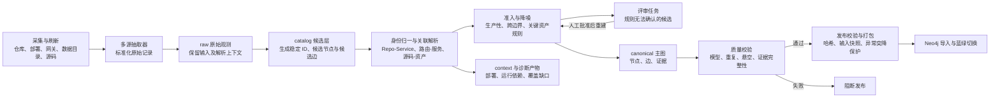

# 022 - Ground Truth KG 搭建与质量保障梳理报告

> **生成时间**：2026年08月19日10时02分56秒（北京时间）
> **修改时间**：2026年08月19日10时02分56秒（北京时间）
> **修改内容**：首次生成；梳理现有数据生产链路、节点与边的抽取方式，并分析准确性、全面性和当前边界。
> **文档概述**：本报告以最近一次通过校验的构建快照 `20260814T175500+0800` 为统计基线。当前 Ground Truth KG 通过多源采集、分层候选、规则准入、证据留存和发布门禁形成可审计的 canonical 主图，共有 **5,581 个节点、12,295 条边和 37,986 条证据**。现有机制能较好保证结构正确和来源可追溯，但尚不能用 `validation_passed=true` 证明事实层面的准确率与召回率。

**索引目录**

- [一、结论与统计口径](#%E4%B8%80%E7%BB%93%E8%AE%BA%E4%B8%8E%E7%BB%9F%E8%AE%A1%E5%8F%A3%E5%BE%84)
  - [1.1 核心结论](#11-%E6%A0%B8%E5%BF%83%E7%BB%93%E8%AE%BA)
  - [1.2 统计口径](#12-%E7%BB%9F%E8%AE%A1%E5%8F%A3%E5%BE%84)
- [二、数据生产链路](#%E4%BA%8C%E6%95%B0%E6%8D%AE%E7%94%9F%E4%BA%A7%E9%93%BE%E8%B7%AF)
  - [2.1 输入来源与职责](#21-%E8%BE%93%E5%85%A5%E6%9D%A5%E6%BA%90%E4%B8%8E%E8%81%8C%E8%B4%A3)
  - [2.2 端到端生产流程](#22-%E7%AB%AF%E5%88%B0%E7%AB%AF%E7%94%9F%E4%BA%A7%E6%B5%81%E7%A8%8B)
  - [2.3 分层产物的作用](#23-%E5%88%86%E5%B1%82%E4%BA%A7%E7%89%A9%E7%9A%84%E4%BD%9C%E7%94%A8)
- [三、节点与边的统计及抽取逻辑](#%E4%B8%89%E8%8A%82%E7%82%B9%E4%B8%8E%E8%BE%B9%E7%9A%84%E7%BB%9F%E8%AE%A1%E5%8F%8A%E6%8A%BD%E5%8F%96%E9%80%BB%E8%BE%91)
  - [3.1 总体规模](#31-%E6%80%BB%E4%BD%93%E8%A7%84%E6%A8%A1)
  - [3.2 节点统计与来源](#32-%E8%8A%82%E7%82%B9%E7%BB%9F%E8%AE%A1%E4%B8%8E%E6%9D%A5%E6%BA%90)
  - [3.3 边统计与来源](#33-%E8%BE%B9%E7%BB%9F%E8%AE%A1%E4%B8%8E%E6%9D%A5%E6%BA%90)
  - [3.4 产物结构分析](#34-%E4%BA%A7%E7%89%A9%E7%BB%93%E6%9E%84%E5%88%86%E6%9E%90)
- [四、准确性保障](#%E5%9B%9B%E5%87%86%E7%A1%AE%E6%80%A7%E4%BF%9D%E9%9A%9C)
  - [4.1 多源证据与事实追溯](#41-%E5%A4%9A%E6%BA%90%E8%AF%81%E6%8D%AE%E4%B8%8E%E4%BA%8B%E5%AE%9E%E8%BF%BD%E6%BA%AF)
  - [4.2 准入、降噪与评审](#42-%E5%87%86%E5%85%A5%E9%99%8D%E5%99%AA%E4%B8%8E%E8%AF%84%E5%AE%A1)
  - [4.3 结构校验与发布门禁](#43-%E7%BB%93%E6%9E%84%E6%A0%A1%E9%AA%8C%E4%B8%8E%E5%8F%91%E5%B8%83%E9%97%A8%E7%A6%81)
  - [4.4 准确性边界](#44-%E5%87%86%E7%A1%AE%E6%80%A7%E8%BE%B9%E7%95%8C)
- [五、全面性保障与缺口](#%E4%BA%94%E5%85%A8%E9%9D%A2%E6%80%A7%E4%BF%9D%E9%9A%9C%E4%B8%8E%E7%BC%BA%E5%8F%A3)
  - [5.1 数据源覆盖情况](#51-%E6%95%B0%E6%8D%AE%E6%BA%90%E8%A6%86%E7%9B%96%E6%83%85%E5%86%B5)
  - [5.2 图谱关系覆盖情况](#52-%E5%9B%BE%E8%B0%B1%E5%85%B3%E7%B3%BB%E8%A6%86%E7%9B%96%E6%83%85%E5%86%B5)
  - [5.3 明确边界](#53-%E6%98%8E%E7%A1%AE%E8%BE%B9%E7%95%8C)
- [六、总体判断](#%E5%85%AD%E6%80%BB%E4%BD%93%E5%88%A4%E6%96%AD)

> **相关文档索引**：[知识图谱构建管线说明](../kg/README.md)｜[知识图谱设计文档](../docs_sxy/%E4%BC%81%E4%B8%9A%E6%8A%80%E6%9C%AF%E7%9F%A5%E8%AF%86%E5%9B%BE%E8%B0%B1%E8%AE%BE%E8%AE%A1-%20v1.md)｜[自动重建与蓝绿发布部署手册](./018-%E7%9F%A5%E8%AF%86%E5%9B%BE%E8%B0%B1%E8%87%AA%E5%8A%A8%E9%87%8D%E5%BB%BA%E4%B8%8E%E8%93%9D%E7%BB%BF%E5%8F%91%E5%B8%83%E9%83%A8%E7%BD%B2%E6%89%8B%E5%86%8C.md)

## 一、结论与统计口径

### 1.1 核心结论

当前 Ground Truth KG 并非“扫描到什么就全部入图”，而是将仓库、部署、网关、数据库目录和源码扫描结果先沉淀为候选事实，再按生产性、跨系统边界、关键资产等规则筛选为 canonical 主图。它的主要优势是每项入图事实均保留来源证据，图结构经过模型与引用完整性校验，发布前还会检查产物完整性、数量突降和输入快照变化。若缺少这些约束，源码中的测试接口、普通方法、普通表以及无法唯一解析的调用会直接污染主图，使 Ground Truth 退化为高噪声资产清单。

不过，现有“准确”主要指**规则范围内可解释、可追溯、结构自洽**，还不是经过人工金标准样本验证的统计准确率。现有“全面”也主要指既定数据源的覆盖情况，而不是完整表达企业云基础设施、全部运行时调用和全量数据血缘。因此，现阶段更准确的定位是“面向 Coding Agent 和技术影响分析的高置信技术事实主图”，不宜直接等同于企业全域事实总库。++本段重写，阐述准确时，着重说明采用什么手段来保证的准确；阐述全面时，着重说明覆盖到了哪些面来保证全面++

### 1.2 统计口径

报告使用最近一次已通过校验的快照 `20260814T175500+0800`，构建时间为 2026年08月14日17时55分00秒（北京时间）。当前工作区存在尚未重新构建的代码与输入变更，因此本报告只描述该快照，不把工作区中的未发布修改视为现行产物。节点与边均统计 `canonical/`，候选规模统计 `catalog/`，覆盖情况取自 `quality/coverage.json`，评审情况取自 `quality/review_summary.json`。

## 二、数据生产链路

### 2.1 输入来源与职责

++将【代表性来源】中的文件都标注清楚来自于哪个skill，例如：outputs/cloud/repo/codeup\_repos.json（skill-）++

| 输入域          | 快照输入规模                                | 主要职责                                                   | 代表性来源                                                                               |
| ------------ | -------------------------------------: | ------------------------------------------------------ | ----------------------------------------------------------------------------------- |
| 仓库与部署        | 191 个 CodeUp Repo、180 条部署记录、190 条部署映射 | 确认哪些仓库实际支撑生产服务，并建立 Repo、Service 和 `IMPLEMENTS`         | `outputs/cloud/repo/codeup_repos.json`、`repos_deploy.csv`、`deploy_map.json`         |
| 网关运行态与配置     | 3,764 条 API、82 个原始配置文件                | 识别真实出现的 HTTP 入口、后端服务及路由属性，建立 EntryPoint 和 `HANDLED_BY` | `outputs/cloud/gateway/api.csv`、`outputs/cloud/gateway/raw/`                        |
| 数据目录与 Schema | 6,254 条目录记录、28 个 Schema 文件            | 识别数据库、表及宿主信息，并为源码数据访问提供可匹配的资产目录                        | `outputs/data/data_topology*.json`、`data_inventory*.csv`、`data_raw/`、`tencent_raw/` |
| 源码扫描         | 178 个仓库，137 个提取到支持事实                  | 抽取 HTTP、gRPC、任务、消息、服务调用、数据库访问和数据管道候选                   | 外部源码根目录 `D:/rise/code/code`                                                         |
| 系统注册种子       | 12 个 System                           | 提供稳定的系统边界，并据 Service 和 Repo 归属派生系统关系                   | `draft/products/product_lines.md` 对应的内置注册种子                                         |

### 2.2 端到端生产流程

构建由 `builder.py` 顺序编排：先抽取 CodeUp、部署、网关、数据目录和源码，再补充 System 归属；随后将完整云资源记录降维为部署与运行上下文，统一补齐模型字段并生成评审任务。只有 `graph_eligible=true` 的候选节点和 `publication_status=published` 的候选边进入 canonical，相关 `fact_ids` 对应的证据才进入最终证据集。自动重建场景还会锁定代码提交和输入快照，构建期间任一方发生变化都会失败，避免使用混合时点数据发布新图。

### 2.3 分层产物的作用

`raw` 用于保存原始观测，使抽取问题能够回溯到具体输入；`catalog` 保存全部候选及其准入、抑制原因，是分析漏报和调整规则的主要依据；`canonical` 是实际发布和查询的高置信子集；`evidence` 通过事实 ID 记录来源、路径、观测时间、解析器版本和原始哈希。`context` 保存不适合进入主图但对 Agent 有用的部署和运行依赖，`quality` 则记录覆盖、校验、源码缺口和普通表访问明细。这种分层避免了在“全部入图导致噪声”与“直接丢弃导致不可审计”之间二选一。

## 三、节点与边的统计及抽取逻辑

### 3.1 总体规模

| 产物  | catalog 候选 | canonical 发布 | 晋升率   |
| --- | ----------: | ------------: | -----: |
| 节点  | 21,939     | 5,581        | 25.4% |
| 边   | 20,465     | 12,295       | 60.1% |

canonical 另包含 37,986 条证据，平均每个节点或边约关联 2.13 条证据。较低的节点晋升率主要来自源码 EntryPoint 候选和普通表的主动压缩，并不等同于抽取失败；是否属于合理降噪，需要结合评审任务和覆盖缺口共同判断。

### 3.2 节点统计与来源

| 节点           | 数量    | 占比    | 含义与作用                                               | 抽取方式及数据来源                                                                                                             |
| ------------ | -----: | -----: | --------------------------------------------------- | --------------------------------------------------------------------------------------------------------------------- |
| `System`     | 12    | 0.2%  | 表示企业系统、平台或产品线，为服务、入口和仓库提供稳定业务边界                     | 从产品线注册种子建立；再根据 Service 名称、Repo 路径等既定规则关联生产 Service                                                                    |
| `Repo`       | 72    | 1.3%  | 表示实际支撑生产服务的代码仓库，用于从代码定位部署单元和所属系统                    | 先读取 191 个 CodeUp 仓库，只有存在生产部署或生产服务实现证据的仓库晋升；来源为 CodeUp 清单和 Flow 部署记录                                                   |
| `Service`    | 104   | 1.9%  | 表示可独立发布、当前支撑生产或被运行态观察到的服务，是调用和数据访问关系的主体             | 84 个由生产部署建立，20 个由网关后端运行态补充；来源为 Flow、部署映射和网关 API                                                                       |
| `EntryPoint` | 4,515 | 80.9% | 表示系统跨边界入口，包括 HTTP、gRPC、定时任务、Webhook、消息消费和 WebSocket | 3,764 个由网关运行态 HTTP 记录直接准入，其余由生产 Service 源码中的跨边界声明或已解析调用准入；其中 HTTP 3,846、gRPC 540、任务 102、Webhook 20、消息消费 5、WebSocket 2 |
| `DataAsset`  | 878   | 15.7% | 表示数据库、关键表、Topic 和 Topic 命名空间，用于影响分析、读写关系和数据血缘       | 目录与 Schema 建立数据库候选，源码配置补充未匹配数据库；表只有满足共享、生产写入、消息消费写入或管道血缘等关键条件才晋升。现有 819 张表、47 个数据库、10 个 Topic、2 个 Topic 命名空间          |

### 3.3 边统计与来源

| 边                 | 数量    | 含义与作用                                  | 抽取方式及数据来源                                                          |
| ----------------- | -----: | -------------------------------------- | ------------------------------------------------------------------ |
| `HANDLED_BY`      | 4,532 | EntryPoint 由哪个 Service 处理，是入口影响分析的核心连接 | 3,764 条来自网关运行态后端解析，768 条来自生产 Service 源码入口映射                        |
| `HAS_ENTRY_POINT` | 4,452 | System 对外或跨边界暴露哪些入口                    | 先通过 `HANDLED_BY` 找到处理 Service，再按 Service 的系统归属派生；来源为网关或源码证据叠加产品线种子 |
| `WRITES`          | 1,049 | Service 写入哪个数据库或关键表                    | 扫描 ORM、SQL、数据源配置、消息消费后写入和数据管道写入，并将目标解析到 DataAsset                  |
| `READS`           | 915   | Service 读取哪个数据库或关键表                    | 扫描 ORM、SQL、数据源配置和数据管道读取；无法唯一解析到表时可降级到数据库级资产                        |
| `CONTAINS`        | 896   | 数据库包含关键表，或 Topic 命名空间包含 Topic          | 对入选关键表建立数据库层级；对消息资产建立命名空间层级，主要由源码扫描后处理发布                           |
| `DEPENDS_ON`      | 96    | Service 对另一个 Service 存在服务级依赖           | 在源码调用或依赖提示能够解析到生产 Service 时发布，补充不需要精确到入口的依赖视角                      |
| `CALLS`           | 94    | Service 调用某个具体 EntryPoint              | 源码扫描客户端调用，只有调用方、目标 Service、方法和路径能够唯一解析时发布                          |
| `HAS_SERVICE`     | 92    | System 拥有哪些生产 Service                  | 根据产品线种子、Service 名称和 Repo 路径规则归属，并记录分配方法和分数                         |
| `IMPLEMENTS`      | 81    | Repo 实现哪个 Service                      | 根据生产 Flow 记录中的 Git 地址、流水线和工作负载映射建立；非生产部署不发布                        |
| `CONTRIBUTES_TO`  | 67    | Repo 参与哪个 System 的建设                   | 由已发布的 `IMPLEMENTS` 和目标 Service 的系统归属派生                             |
| `DERIVED_FROM`    | 11    | 一个数据资产由另一个数据资产派生                       | 当前主要根据显式数据管道引用，以及“消息消费入口对应 Service 写入关键表”链路推导                      |
| `CONSUMES`        | 5     | 消息 EntryPoint 消费哪个 Topic 或 Queue       | 扫描 RocketMQ、Kafka、RabbitMQ 等已支持的消费者声明，并解析 Broker 与主题               |
| `PRODUCES`        | 5     | Service 向哪个 Topic 或 Queue 生产消息         | 扫描已支持的消息客户端调用，在 Topic 可解析且所属 Service 为生产服务时发布                      |
| `INVOKES`         | 0     | EntryPoint 到 EntryPoint 的内部调用链         | 模型已定义，但当前快照尚未形成可发布事实；调用关系目前主要以 `CALLS` 表达                          |

### 3.4 产物结构分析

节点中 EntryPoint 占 80.9%，边中 `HANDLED_BY` 与 `HAS_ENTRY_POINT` 合计占 73.1%，说明当前主图对“系统暴露了什么入口、入口落到哪个服务”表达最充分。DataAsset 虽有 878 个，但其中 819 个是关键表；系统、仓库和服务作为骨架节点数量较少，符合其聚合定位。

关系分布同时暴露出明显的不均衡：只有 94 条精确 `CALLS`，消息生产与消费各 5 条，数据派生 11 条，`INVOKES` 为 0。由此可见，当前图谱更接近“生产服务与 API/数据资产目录”，尚未形成完整的同步调用链、异步消息链和端到端数据血缘图。

## 四、准确性保障

### 4.1 多源证据与事实追溯

canonical 的每个节点和边都要求至少一个 `fact_id`，证据记录包含来源、原始路径、观测时间、解析器版本和原始内容哈希。37,986 条证据中，网关配置 15,006 条、网关运行记录 11,312 条、源码扫描 6,338 条、产品线种子 4,649 条，其余 681 条来自 Flow、部署映射、CodeUp 和数据目录。网关相关证据占 69.3%，这既解释了入口事实为何最丰富，也说明当前可信度主要建立在网关数据质量之上。

多源信息不是简单并列：Repo 需要 CodeUp 身份与生产部署相互印证，网关运行记录确定真实入口并由原始配置补充路由属性，数据目录提供资产身份而源码提供读写行为。完整证据不导入 Neo4j，而是保留在对应运行目录，因此审计和纠错必须保留该快照，不能只保留在线图。

### 4.2 准入、降噪与评审

准入规则优先保留生产事实、跨边界入口和关键数据资产。网关抽取会过滤扫描器探测、WebShell 和常见恶意路径；源码中的普通方法、健康检查、文档接口和测试 Mock 不直接进入主图；普通表访问保留在质量明细，只有共享表、业务写表、消息消费写表或管道血缘表才晋升。这种压缩显著减少误报，但代价是规则未覆盖的新框架和动态模式更容易成为漏报。

无法仅凭结构化证据确认的源码 EntryPoint 会进入评审任务。当前有 12,384 个任务，其中 4,138 个可进行 LLM 辅助评审，但 LLM 只能生成草稿；只有带输入哈希且经人工批准的决策，才能在重新构建时进入 canonical。该快照的人工决策应用数为 0，因此人工闭环目前是已实现能力，而不是已经为现有快照提供的质量背书。

### 4.3 结构校验与发布门禁

本次快照校验确认：悬空关系为 0，节点和边均无重复，37,986 条证据与入图事实双向一致，模型字段和关系端点类型无错误。自动发布还会验证核心节点、核心关系、构建时间和运行 ID，计算产物哈希，并与活动版本比较节点总数、边总数及各类型数量；超过阈值的异常下降会阻断发布。构建期间代码提交、输入快照或远端活动基线发生变化也会失败，从而避免半新半旧的数据进入生产图。

### 4.4 准确性边界

当前所有 17,876 个 canonical 节点与边都标记为 `high`，但这一标记来自规则准入，并非抽样测量得到的置信概率。`validation_passed=true` 证明的是结构、模型和证据引用完整，不验证“服务归属是否符合业务事实”“源码解析的数据库是否选对实例”或“动态调用是否被正确还原”。因此，若要正式宣称 Ground Truth 的准确率，还需要按节点和边类型建立人工金标准样本，分别计算精确率，并重点核验名称归一、路径匹配、多数据源解析和派生血缘。

## 五、全面性保障与缺口

### 5.1 数据源覆盖情况

| 数据域           | 当前覆盖判断    | 分析                                                                          |
| ------------- | --------- | --------------------------------------------------------------------------- |
| CodeUp 与 Flow | `KNOWN`   | 已读取 191 个 Repo、180 条部署和 190 条部署映射，但 `KNOWN` 表示输入文件已被读取，不自动证明上游清单覆盖所有真实仓库和部署 |
| 网关 API        | `KNOWN`   | 3,764 条运行态 API 是当前入口主干；原始配置单独为 `PARTIAL`，82 个文件中解析 34 个，另有 28 个明确不支持        |
| 数据目录与 Schema  | `KNOWN`   | 6,254 条目录记录和 28 个 Schema 文件已处理，Schema 解析为 28/28；是否覆盖全部实例仍取决于上游采集权限与范围       |
| 源码扫描          | `PARTIAL` | 178 个仓库中137个提取到支持事实，覆盖率约77.0%；41个仓库没有支持的入口或依赖事实，动态 URL、反射、配置中心和封装客户端仍可能遗漏   |
| 人工评审          | 未闭环       | 候选任务和决策账本已经具备，但当前快照没有应用人工决策，无法依靠人工确认补齐规则覆盖盲区                                |

### 5.2 图谱关系覆盖情况

catalog 到 canonical 的节点晋升率只有 25.4%，边晋升率为 60.1%。节点压缩主要是主动控制源码入口和普通表噪声：源码发现 14,852 个 EntryPoint 候选，最终发布 4,515 个；源码和 Schema 发现大量表事实，其中 819 张关键表进入节点，另有 2,327 张普通表保留为访问证据。这种设计保证主图可用，但“未入图”同时混合了合理抑制、解析失败、身份不唯一和等待评审四类情况，全面性分析必须继续按原因拆分，而不能只比较总数。

关系层面的主要缺口比节点更明确。精确服务调用、消息闭环和数据血缘数量远低于入口与处理关系，意味着图谱可以较好回答“某系统有哪些入口、入口由谁处理”，但回答“请求经过哪些服务”“消息最终影响哪些表”“某表的完整上游来源”时仍可能漏链。后续如果要提高全面性，应优先建设可验证的关系召回率，而不是单纯扩大节点数量。

### 5.3 明确边界

当前模型主动删除了 `CloudResource` 主图节点，VPC、子网、安全组、磁盘和负载均衡附件等基础设施拓扑由其他系统承担；代码相关的部署摘要和宿主信息只作为 Service、DataAsset 属性或 `context/` 记录保留。Neo4j 导入使用 merge，不负责自动删除旧图中本次快照已经不存在的事实，因此生产切换必须依靠独立图槽或外部清理机制避免陈旧节点残留。完整证据也不在线查询，若构建运行目录丢失，事实仍可查询，但可审计性会显著下降。

## 六、总体判断

当前 Ground Truth KG 已形成较完整的工程生产体系：输入可分源追溯，候选与主图分离，准入规则控制噪声，校验和发布流程能够阻断明显坏图。从“如何搭建”和“如何保证不会发布结构损坏、证据缺失或数量异常的图”来看，机制已经闭环。

质量上的关键短板不在图数据库或产物格式，而在语义评估：现有系统还没有用人工金标准证明各类事实的精确率，也没有为服务调用、消息和血缘建立可靠的召回率分母。因此，目前可以有把握地称其为**有证据、可审计、偏重生产入口的高置信技术知识图谱**；要进一步强化“Ground Truth”这一称谓，需要补上分类型抽样核验、误报与漏报指标，以及评审决策持续回流三项能力。