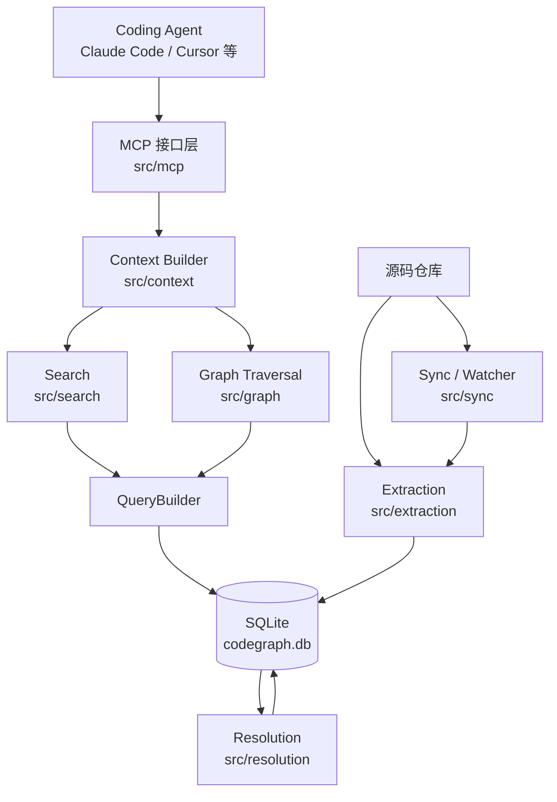
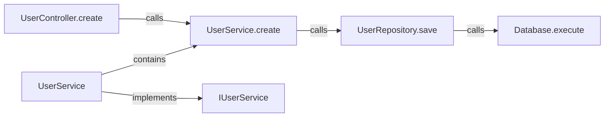
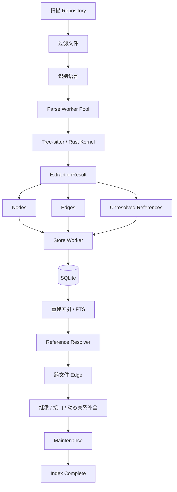
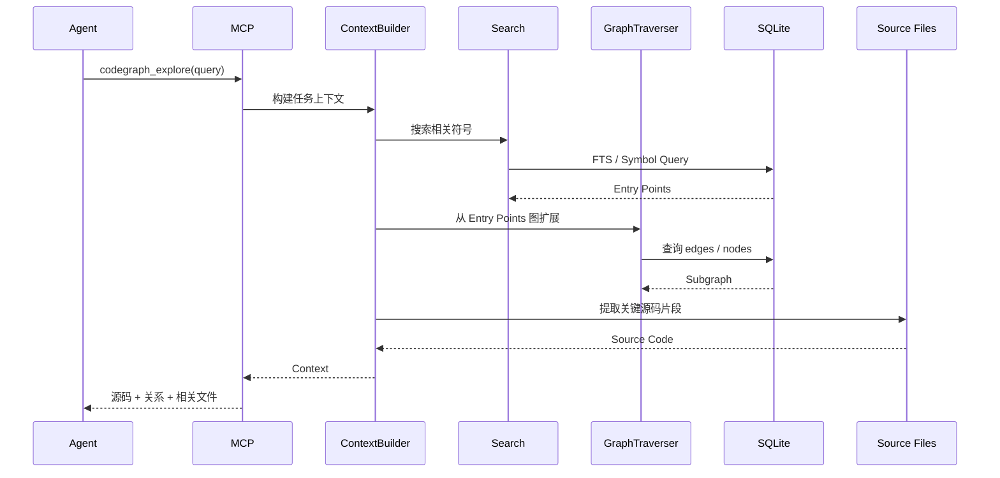
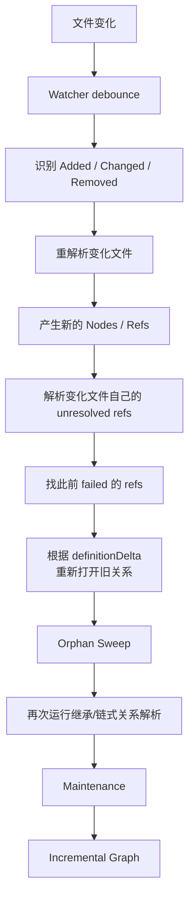
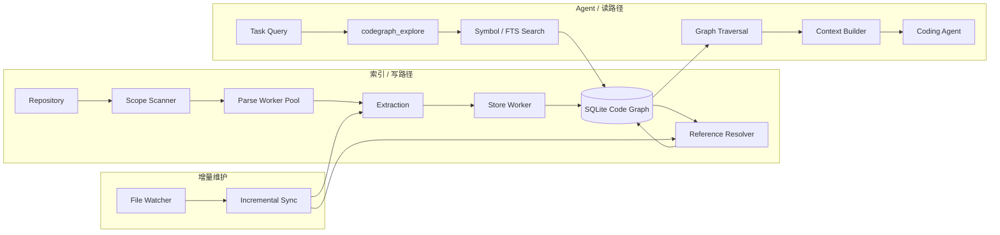
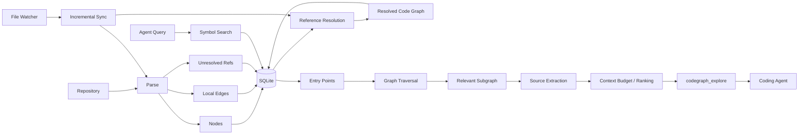

# CodeGraph 源码级教程：从源码索引到 Agent 上下文构建

> 本文基于 `colbymchenry/codegraph` 当前主分支源码分析。重点不是罗列命令，而是解释 CodeGraph 为什么这样设计、源码如何分层、数据怎样流动，以及它如何把一个代码仓库转换成适合 Coding Agent 使用的结构化上下文。CodeGraph 的定位是：提前把代码仓库构造成一个本地代码知识图，使 Agent 不必在每次任务中重复执行大量搜索、读取和调用链追踪。

---

# 1. CodeGraph 的核心思想

## 1.1 它试图解决什么问题

传统 Coding Agent 理解一个陌生仓库时，通常会执行类似流程：
```text
用户问题
  ↓
搜索关键词
  ↓
打开几个文件
  ↓
发现函数 A
  ↓
搜索谁调用 A
  ↓
继续打开文件
  ↓
追踪 import / interface / implementation
  ↓
逐渐建立代码结构认知
```

问题在于，这些工作本质上具有很强的重复性。

例如 Agent 今天需要理解：
```text
HTTP Request
    ↓
Controller
    ↓
Service
    ↓
Repository
    ↓
Database
```

明天修改另一个相关功能时，很可能重新做一遍类似搜索。

CodeGraph 的思路是：

> 把“理解代码结构”从 Agent 在线推理阶段前移到离线索引阶段。

先建立：
```text
源码
 ↓
语法解析
 ↓
代码实体
 ↓
跨文件关系解析
 ↓
代码知识图
 ↓
SQLite 持久化
```

Agent 工作时变成：
```text
任务描述
 ↓
检索入口节点
 ↓
图遍历
 ↓
获取相关调用链/依赖关系
 ↓
提取关键源码
 ↓
一次性返回结构化上下文
```

README 明确把 CodeGraph 描述为一个预先建立的本地代码知识图，数据保存在 `.codegraph/codegraph.db`，索引阶段负责抽取函数、类、方法，以及调用、导入、继承、实现等关系。

因此，理解 CodeGraph 最重要的一句话是：

> **CodeGraph 不是给代码做普通文本切块，而是在构建“符号级代码图”。**

---

## 1.2 整体架构

从源码结构看，CodeGraph 可以划成八个主要层次。`src/` 下分别存在 `extraction`、`resolution`、`db`、`graph`、`search`、`context`、`mcp`、`sync` 等模块。


这里实际上存在两条完全不同的数据路径：

**写入路径：**
```text
源码 → Extraction → Resolution → SQLite
```

**读取路径：**
```text
Agent → MCP → Search → Graph Traversal → Context Builder
```

理解这一点之后，再看源码就不会乱。

---

# 2. 源码模块地图

CodeGraph 的主入口是 `src/index.ts` 中的 `CodeGraph` 类。源码并没有让所有模块互相直接依赖，而是由 `CodeGraph` 统一完成各层装配。


| 模块                | 主要职责                | 所处阶段      |
| ----------------- | ------------------- | --------- |
| `src/index.ts`    | 总入口、生命周期管理、模块装配     | 全局        |
| `src/extraction/` | 解析源码、提取节点和初步关系      | 建图        |
| `src/resolution/` | 将符号引用解析到真实定义        | 建图        |
| `src/db/`         | SQLite、SQL、索引、迁移    | 存储        |
| `src/graph/`      | BFS/DFS、调用链、影响范围等   | 查询        |
| `src/search/`     | 查询解析与符号搜索           | 查询        |
| `src/context/`    | 搜索 + 图扩展 + 源码拼装     | Agent 上下文 |
| `src/mcp/`        | 向 Coding Agent 暴露工具 | Agent 接口  |
| `src/sync/`       | 文件监听与增量索引           | 实时更新      |


`CodeGraph` 本质上可以看作一个 Facade：
```text
                     CodeGraph
                        │
       ┌────────────────┼──────────────────┐
       │                │                  │
ExtractionOrchestrator  ReferenceResolver  GraphQueryManager
       │                │                  │
       └────────────────┼──────────────────┘
                        │
                 GraphTraverser
                        │
                 ContextBuilder
                        │
                    QueryBuilder
                        │
                     SQLite
```

源码中的 `wireLayers()` 就是在做这件事情：基于同一个 `QueryBuilder` 和数据库连接创建 Extraction、Resolution、Graph、Traversal、Context 等组件。

这也是阅读源码时最适合的入口。

---

# 3. CodeGraph 到底把代码存成什么

## 3.1 图不是存在 Neo4j，而是存在 SQLite

这是 CodeGraph 一个非常关键的工程选择。

它没有引入独立图数据库，而是直接使用关系模型保存：
```text
nodes
edges
files
unresolved_refs
nodes_fts
name_segment_vocab
project_metadata
```

其中最重要的是：
```text
nodes + edges
```

也就是经典的属性图模型：
```text
G = (V, E)
```

只不过：
```text
V → SQLite nodes 表
E → SQLite edges 表
```

图遍历逻辑由应用层实现。Schema 中可以直接看到 `nodes`、`edges`、`files` 和全文索引结构。

---

## 3.2 Node：代码中的“实体”

`nodes` 中记录的是代码符号。

典型节点包括：
```text
file
module
namespace

class
interface
struct
trait

function
method

variable
constant
field
property

enum
route
component
...
```

一个节点不仅仅保存名字，还保存：
```text
id
kind
name
qualified_name
file_path
language

start_line
end_line
start_column
end_column

docstring
signature
visibility

is_async
is_static
is_abstract

decorators
type_parameters
return_type
```

例如：
```python
class UserService:
    def create_user(self, data):
        ...
```

可能形成：
```text
Node
├── kind: class
├── name: UserService
└── file: user_service.py
```

以及：
```text
Node
├── kind: method
├── name: create_user
├── qualified_name: UserService.create_user
└── file: user_service.py
```

节点甚至保存 `return_type`，因为后续跨文件解析方法调用时，返回类型本身也是推断调用目标的重要信息。

---

## 3.3 Edge：真正体现代码结构的信息

如果只有 Node，CodeGraph 和普通符号索引差别并不大。

真正重要的是 Edge。

例如：
```python
def create_user():
    validate_user()
    save_user()
```

CodeGraph 希望建立：
```text
create_user
   │
   ├── calls ──> validate_user
   │
   └── calls ──> save_user
```

其他典型关系还包括：
```text
contains
imports
calls
references
extends
implements
```

因此整个项目最终形成类似：


一旦这张图已经存在，回答：

> 修改 `UserRepository.save()` 可能影响哪里？

就不再是全文搜索问题，而是：
```text
从 save 节点沿 incoming calls 边向上遍历。
```

这就是 CodeGraph 与普通代码搜索工具最本质的差异。

---

# 4. 最关键的数据结构：unresolved\_refs

这是理解 CodeGraph 架构的第一个核心点。

## 4.1 为什么 Parser 不能直接建立所有 Edge

考虑：
```python
# service.py

from repository import save_user

def create_user():
    save_user()
```

Parser 看到：
```text
save_user()
```

只能很容易知道：
```text
这里出现了一个名为 save_user 的调用引用
```

但要判断它究竟对应哪个：
```text
repository.save_user
user_repo.save_user
mock.save_user
...
```

需要知道：

- import；
- namespace；
- package；
- class；
- inheritance；
- receiver type；
- workspace；
- language rules。

这已经超出了单文件 AST 解析的职责。

所以 CodeGraph 没有强行让 Extraction 一步完成全部工作。

而是拆成：
```text
Extraction
      ↓
发现一个引用
      ↓
unresolved_refs
      ↓
Resolution
      ↓
找到真正定义
      ↓
Edge
```

Schema 对 `unresolved_refs` 的生命周期定义非常明确：
```text
pending
   │
   ├── 解析成功 → 删除 unresolved_ref + 创建 edge
   │
   └── 解析失败 → failed
                       │
                       └── 后续增量索引再次尝试
```

失败引用不会简单丢弃，因为未来新增文件可能恰好提供这个符号。

---

## 4.2 为什么这个设计非常重要

它实际上把代码分析拆成了：

### 第一阶段：局部分析
```text
每个文件自己解析自己。
```

优点：
```text
天然可以并行
不要求其他文件已经解析完
语言 Parser 更简单
```

### 第二阶段：全局链接
```text
所有符号已经进入数据库以后，
再解决“这个引用究竟指向谁”。
```

这和编译系统中的：
```text
编译
+
链接
```

非常类似。

可以把 CodeGraph 理解成：
```text
源码 Parser
    ↓
中间符号表示
    ↓
Symbol Linking
    ↓
Code Graph
```

这比“Parser 直接生成完整知识图”稳定得多。

---

# 5. 全量索引的数据管线

`CodeGraph.indexAll()` 是理解整个写入流程的核心入口。源码中首先通过进程内 Mutex 和跨进程 `FileLock` 防止多个索引任务同时写入数据库。

完整流程可以概括为：


下面按照数据流依次解释。

---

## 5.1 第一阶段：文件发现与过滤

并不是仓库里的每一个文件都值得索引。

CodeGraph 默认会跳过：
```text
依赖目录
构建产物
缓存目录
.gitignore 中的文件
过大的文件
```

同时可以通过项目配置进一步定义：
```text
include
exclude
custom extensions
```

因此第一阶段其实是在定义：
```text
Repository
    ↓
Index Scope
```

这是后续所有性能优化的第一道防线。README 对默认跳过规则和配置项有专门说明。

---

# 6. Extraction：如何从代码产生图节点

## 6.1 并行 Parser Pool

CodeGraph 并没有在主线程逐文件解析。

源码中的 `ParseWorkerPool` 基于 Worker 建立 Parser 池，默认并发规模根据 CPU 数量计算，并为每个 Worker 提前装载对应语言 Grammar。对于全量索引，还提供 `prewarm()` 提前拉起整个 Worker Pool，避免大量文件解析时逐渐启动线程带来的冷启动损耗。

架构可以表示为：
```text
               ┌─ Parse Worker 1
               │
Files Queue ───┼─ Parse Worker 2
               │
               ├─ Parse Worker 3
               │
               └─ Parse Worker N
                        ↓
                ExtractionResult
```

Worker 返回的不是源码文本，而是结构化结果：
```text
ExtractionResult
├── nodes
├── edges
├── unresolvedReferences
└── kernelBuffers
```

---

## 6.2 为什么解析和数据库写入也要分离

如果每个 Parser Worker 同时去写 SQLite：
```text
Worker1 ─┐
Worker2 ─┼─> SQLite
Worker3 ─┤
Worker4 ─┘
```

很容易形成写锁竞争。

CodeGraph 因此进一步拆成：
```text
Parse Workers
      │
      ↓
Store Queue
      │
      ↓
Store Worker
      │
      ↓
SQLite
```

`StoreWriter` 就是主线程和 Store Worker 之间的桥梁。

一个完整的 `StoreBundle` 包含：
```text
nodes
edges
refs
file
```

写入之前还会执行一致性检查：

- 无合法 identity 的 node 被过滤；
- edge 两端必须是本次合法插入的节点；
- unresolved reference 的来源节点必须存在；
- reference 会补齐 `filePath` 和 `language`。

---

## 6.3 背压机制

这里还有一个容易忽略但很成熟的设计。

假设 Parser：
```text
每秒解析 100 个文件
```

而 SQLite：
```text
每秒只能写 30 个文件
```

如果无限制生产：
```text
Parse
 ↓↓↓↓↓↓↓↓↓↓↓↓↓↓↓↓↓
Queue
 ↓
Store
```

内存会持续上涨。

因此 `StoreWriter` 维护：
```text
outstanding
```

即已经发送、尚未确认写入的 Bundle 数量，并提供：
```text
waitBelow(limit)
```

作为背压控制。

整个 Extraction 实际是一个生产者—消费者管线：
```text
File Discovery
     ↓
Parse Pool
     ↓
Buffer
     ↓
Backpressure
     ↓
Store Worker
     ↓
SQLite
```

这是 CodeGraph 能处理大型仓库的重要工程基础。

---

# 7. Resolution：CodeGraph 最核心的静态分析阶段

Extraction 解决的是：

> “代码里有什么？”

Resolution 解决的是：

> “这些东西之间到底是什么关系？”

这两个问题不能混为一谈。

---

## 7.1 ReferenceResolver 的职责

源码中的核心类为：
```text
ReferenceResolver
```

其注释直接说明：

> 使用多种策略编排引用解析。

它内部维护：
```text
Framework Resolver
Import Mapping
Name Cache
Qualified Name Cache
Method Match Cache
File Cache
...
```

并且大量缓存已经改成有界 LRU，源码注释指出之前无界 Map 在 2 万以上文件的代码库中可能导致内存问题。

基本流程是：
```text
UnresolvedReference
      ↓
读取引用名称
      ↓
分析所在文件
      ↓
分析 imports
      ↓
分析 namespace / package
      ↓
分析 receiver type
      ↓
寻找候选 Node
      ↓
候选排序 / 消歧
      ↓
得到目标 Node
      ↓
创建 Edge
```

---

## 7.2 为什么需要多轮 Resolution

很多关系不是一次就能解析出来。

例如：
```java
interface Storage {
    void save();
}

class MySQLStorage implements Storage {
    void save() {}
}
```

再出现：
```java
storage.save();
```

首先需要知道：
```text
MySQLStorage implements Storage
```

才能进一步处理：
```text
storage.save()
```

因此 `ReferenceResolver` 源码专门保留了：
```text
deferredChainRefs
deferredThisMemberRefs
```

它们会等待 implements / extends 等关系建立以后，再进行第二轮解析。

整个过程不是：
```text
Parse → Resolve → Finish
```

而更接近：
```text
Parse

 ↓

基础关系解析

 ↓

extends / implements 建立

 ↓

链式调用重新推断

 ↓

继承成员重新解析

 ↓

补充图边
```

这是第二个必须理解的核心设计：

> **CodeGraph 的知识图不是 Parser 一次生成的，而是经过多轮逐步收敛出来的。**

---

# 8. SQLite 为什么足够支撑代码图

## 8.1 图查询和全文搜索同时存在

数据库中除了：
```text
nodes
edges
```

还建立了：
```text
nodes_fts
```

SQLite FTS5 索引字段包括：
```text
name
qualified_name
docstring
signature
```

所以 CodeGraph 能同时执行两种完全不同的检索：

### 符号搜索
```text
用户说：
"authentication middleware"

         ↓

FTS / symbol search

         ↓

AuthMiddleware
authenticate
verifyToken
```

### 图关系搜索
```text
AuthMiddleware

      ↓ graph traversal

authenticate
   ↓
verifyToken
   ↓
TokenService
```

Schema 明确使用 FTS5 而非独立向量存储。

因此源码中虽然把部分过程称作 `semantic search`，更准确地理解应该是：

> **符号/全文相关性检索负责找到入口，代码图负责扩展结构关系。**

它不是典型的：
```text
源码
 ↓
Embedding
 ↓
Vector DB
 ↓
Top-K Chunk
```

而是：
```text
源码
 ↓
Symbol Graph
 ↓
FTS 找入口
 ↓
Graph Expand
 ↓
源码提取
```

这也是它非常适合 Coding Agent 的原因。

---

## 8.2 自然语言和代码命名之间的桥

Schema 中还有一个很有意思的表：
```text
name_segment_vocab
```

例如：
```text
OrderStateMachine
```

会被拆成：
```text
order
state
machine
```

这样自然语言里的：
```text
"order state handling"
```

能够与：
```text
OrderStateMachine
```

建立更好的联系。

源码中特意解释了为什么单靠 FTS 不够：默认 tokenizer 并不会自动把 camelCase 标识符拆成这些独立词，因此 CodeGraph 单独物化了 identifier segment vocabulary。

这是一个小设计，但非常适合代码搜索。

---

# 9. 查询阶段：一个 Agent 问题如何变成上下文

现在进入 CodeGraph 的读取路径。

假设 Agent 问：
```text
Where is authentication handled and what calls it?
```

整体流程如下：


---

# 10. ContextBuilder：搜索和图的汇合点

如果只想找一个“CodeGraph 查询的核心类”，那么就是：
```text
ContextBuilder
```

源码自己的注释已经给出了完整 Pipeline：

1. 解析任务输入；
2. 搜索入口节点；
3. 围绕入口节点扩展代码图；
4. 为关键节点提取代码；
5. 格式化给 Agent。

也就是：
```text
Task
 ↓
Search
 ↓
Entry Points
 ↓
Graph Expansion
 ↓
Subgraph
 ↓
Source Extraction
 ↓
TaskContext
```

最终 `TaskContext` 包含：
```text
query

subgraph

entryPoints

codeBlocks

relatedFiles

summary

stats
```

这里非常值得注意：

> CodeGraph 返回的并不是“搜索结果列表”，而是一份经过图扩展后的任务上下文。

---

# 11. GraphTraverser：为什么搜索到一个节点还不够

例如搜索：
```text
payment
```

得到：
```text
PaymentService.pay()
```

普通代码搜索到这里基本结束。

CodeGraph 接下来会：
```text
PaymentService.pay
       │
       ├── calls
       ├── references
       ├── contains
       ├── implements
       └── ...
```

沿关系继续扩展。

`GraphTraverser` 实现 BFS 和 DFS，并支持：
```text
maxDepth
edgeKinds
nodeKinds
direction
limit
```

BFS 中还特别调整了边的访问优先级：
```text
contains
   ↓
calls
   ↓
其他 reference
```

这样会优先理解程序内部结构和调用关系，而不是过早向大量普通引用发散。

默认 ContextBuilder 本身也相当克制，目前默认入口数量、遍历深度和最大节点数都有明确限制，以避免一个入口节点扩展成整个仓库。

这体现出 CodeGraph 查询设计的核心目标：

> 不是“找到尽可能多的关联代码”，而是“用有限上下文覆盖任务最关键的代码结构”。

---

# 12. Impact Radius：为什么知识图适合代码修改

图结构还有一个普通 RAG 很难直接实现的能力：
```text
影响分析
```

例如修改：
```text
validateToken()
```

可以反向查找：
```text
谁调用 validateToken
 ↓
谁又调用这些调用者
 ↓
哪些模块最终依赖它
```

源码中的：
```text
getImpactRadius(nodeId, maxDepth = 3)
```

正是围绕目标节点建立潜在受影响子图。

因此：
```text
代码搜索：
Where is X?
```

和：
```text
代码知识图：
What depends on X?
```

实际上是两个等级的问题。

这也是 CodeGraph 对 Coding Agent 最有价值的地方之一。

---

# 13. codegraph\_explore：为什么 MCP 默认只强调一个工具

CodeGraph 并没有把几十个底层操作全部塞给 Agent。

README 当前明确把：
```text
codegraph_explore
```

作为默认暴露的主要 MCP 工具，其他底层工具仍然存在，但默认隐藏。其设计依据是作者的 Agent 行为测试：一个明确的高层工具比大量细粒度工具更容易让 Agent 正确使用。

这实际上体现了一条很重要的 Agent Harness 原则：
```text
底层能力可以很多
        ≠
直接暴露给 Agent 的 Tool 应该很多
```

CodeGraph 内部可能存在：
```text
search
callers
callees
impact
context
graph traversal
source extraction
...
```

但 Agent 看到的主要入口被收敛为：
```text
codegraph_explore
```

即：
```text
Agent
  │
  │ 一个高层意图
  ↓
codegraph_explore
  │
  ├── Search
  ├── Graph
  ├── Context
  └── Source
```

复杂度被 Harness 吸收，而不是交给 LLM 自己编排。

---

# 14. Explore 的上下文预算设计

`codegraph_explore` 不是简单：
```text
搜索到什么 → 全部返回什么
```

否则大型项目一次调用就可能返回几十万 Token。

源码中存在专门的输出预算系统，并根据项目规模调整：
```text
最多返回多少字符
最多多少文件
每个文件多少字符
每种关系最多多少条
```

同时文件相关性不是简单统计关键词数量，而会考虑：
```text
节点类型
图中的参与程度
生成代码 / 测试代码惩罚
相对于最佳结果的相关性
```

例如源码特别指出：
```text
function / class
```

比一个孤立的：
```text
constant / variable
```

对架构问题的信息价值更高。

而某个弱节点如果：
```text
没有 incoming edge
也没有 outgoing edge
```

很可能只是名字碰撞，权重会显著降低。

这说明它的 Retrieval 已经不是：
```text
Top-K Symbol
```

而更像：
```text
文本相关性
   ×
符号信息量
   ×
图结构证据
   ×
文件质量
```

之后再决定哪些源码值得进入 Agent Context。

---

# 15. 一个非常 Agent 化的设计：返回源码后要求不要再 Read

`codegraph_explore` 的输出不仅包含结构信息，还会直接携带选中的源码。

源码甚至专门维护：
```text
本次 explore 已经向 Agent 返回了
哪些文件
哪些行
多少字节
```

作为 session state，用于后续去重。

因此它在做的不是单纯：
```text
告诉 Agent：
“你应该去看 user_service.py”
```

而是：
```text
直接把 user_service.py 的关键源码给 Agent
并告诉 Agent：
这部分已经相当于 Read 过了
```

于是：
```text
没有 CodeGraph

Grep → Read → Grep → Read → Grep → Read


使用 CodeGraph

Explore → 得到搜索结果 + 图关系 + 源码
```

这才是它节约 Agent 工具调用和上下文消耗的真正来源。

---

# 16. 增量同步：CodeGraph 最容易被低估的设计

如果每修改一行代码都重新构建整个仓库：
```text
Full Index
```

显然无法作为 Coding Agent 的实时辅助系统。

因此 CodeGraph 有完整的 watcher + incremental sync。

README 描述的默认机制是：
```text
OS 文件事件
      ↓
quiet debounce
默认约 2 秒
      ↓
incremental sync
```

同时如果查询发生在数据库尚未同步完成时，还会返回 staleness 提示。

---

# 17. 增量更新并不是“重新解析修改文件”

这是源码里一个非常关键的细节。

假设：
```text
A.ts

function foo() {
    bar();
}
```

原来：
```text
B.ts
function bar() {}
```

后来你删除 B.ts 中的 `bar()`，并在：
```text
C.ts
```

重新定义：
```text
function bar() {}
```

变化的文件是：
```text
B.ts
C.ts
```

但：
```text
A.ts
```

并没有发生任何修改。

然而 A 中原来的：
```text
foo → B.bar
```

已经失效。

如果所谓增量索引只是：
```text
重新解析 B
重新解析 C
```

A 的 Edge 永远不会修复。

---

## 17.1 CodeGraph 如何处理这个问题

源码中专门存在：
```text
definitionDelta
```

如果某些定义发生变化，会执行：
```text
resurrectStaleResolutionEdges(...)
```

将受影响的旧解析关系重新打开，再让 resolver 重新决定目标。

所以增量同步的数据管线其实是：


因此 CodeGraph 的增量维护包含两个方向：

### 出向影响
```text
修改文件里的引用改变了。
```

重新解析这个文件。

### 入向影响
```text
其他没修改的文件，
原来引用了这个文件里的定义。
```

重新绑定这些关系。

这个设计才能使：
```text
Incremental Index
```

逐渐收敛到：
```text
Full Rebuild
```

的结果。

这比“文件 hash 不一样就重新 parse”要复杂得多。

---

# 18. 全量索引与增量索引的统一模型

到这里可以得到 CodeGraph 建图过程真正的状态机：
```text
                 ┌──────────────┐
                 │   Source     │
                 └──────┬───────┘
                        ↓
                 ┌──────────────┐
                 │ Extraction   │
                 └──────┬───────┘
                        ↓
             ┌──────────────────────┐
             │ Partially Known Graph│
             │                      │
             │ Nodes                │
             │ Local Edges          │
             │ Unresolved Refs      │
             └──────────┬───────────┘
                        ↓
                 ┌──────────────┐
                 │ Resolution   │
                 └──────┬───────┘
                        ↓
             ┌──────────────────────┐
             │ Resolved Code Graph  │
             └──────────┬───────────┘
                        │
              source changed
                        │
                        ↓
                 Incremental Sync
                        │
                        └─────────────┐
                                      ↓
                              Resolution Again
                                      │
                                      └──→ Graph
```

这里最值得记住的是：

> **CodeGraph 的图不是一个静态生成物，而是一个持续维护、不断重新解析引用关系的派生状态。**

---

# 19. 索引阶段的几个重要工程优化

核心算法之外，源码里还有几个很典型的工程设计。

## 19.1 双层写锁

`indexAll()` 同时使用：
```text
indexMutex
+
FileLock
```

分别解决：
```text
同一进程多个异步任务

不同进程：
CLI / MCP / Git Hook
```

竞争写数据库的问题。

---

## 19.2 Bulk Load

大量插入 Node 时，如果每次 Insert 都同步维护：
```text
FTS
Secondary Index
```

写放大会非常严重。

因此全量索引时会临时进入 Bulk Load 模式：
```text
关闭部分实时索引维护

       ↓

批量写 Nodes

       ↓

重新建立 Secondary Index

       ↓

重新构建 FTS
```

本质上用：
```text
一次 O(N) 重建
```

替代：
```text
N 次增量维护
```

---

## 19.3 WAL Checkpoint 控制

已有数据库执行大量写入时使用 WAL，但 CodeGraph 会主动控制 checkpoint 时机，避免索引过程中频繁把热点页刷回主数据库文件。

这类优化说明：

> CodeGraph 真正优化的对象不是单次 SQL，而是“几十万符号批量入库”这一完整 workload。

---

## 19.4 Fresh Index 可以更激进

新建数据库时，即使构建失败：
```text
数据库本身可以丢弃重建
```

因此可以采用比已有正式索引更激进的数据库配置。

已有数据库则必须：
```text
保证可恢复性
```

这是典型的：
```text
Disposable Build Artifact
vs
Live Persistent State
```

区别。

---

# 20. CodeGraph 的完整读写架构

把前面的内容合并，最终架构实际上可以画成下面这样：


如果只记这一张图，基本就能够定位 CodeGraph 的所有核心源码。

---

# 21. 为什么 CodeGraph 不等于传统代码 RAG

两者处理的知识单元完全不同。


| 维度            | 普通代码 RAG           | CodeGraph                       |
| ------------- | ------------------ | ------------------------------- |
| 基本单元          | 文本 Chunk           | Symbol Node                     |
| 主要索引          | Embedding          | FTS + Graph                     |
| 关系            | 通常隐式               | 显式 Edge                         |
| function call | 靠模型理解              | 图关系                             |
| inheritance   | 靠文本推断              | extends / implements            |
| callers       | 再次搜索               | incoming edges                  |
| blast radius  | 较难直接计算             | Graph Traversal                 |
| 更新            | 重算 Chunk/Embedding | 增量解析 + 关系重绑定                    |
| Agent 获取信息    | Top-K Chunk        | Entry Point → Subgraph → Source |


举一个最典型的问题：
```text
“修改 authenticate() 会影响哪些模块？”
```

普通 RAG：
```text
authenticate
 ↓ embedding/search
若干相似 Chunk
 ↓
LLM 自己推理
```

CodeGraph：
```text
authenticate Node
 ↓
incoming calls
 ↓
caller
 ↓
incoming calls
 ↓
上游依赖
```

因此二者并不是简单竞争关系。

更加合理的系统甚至可以是：
```text
                 用户问题
                    │
           ┌────────┴────────┐
           ↓                 ↓
      Code Graph          Vector RAG
           │                 │
    结构 / 依赖关系       文档 / 语义知识
           │                 │
           └────────┬────────┘
                    ↓
                  Agent
```

---

# 22. 从 Agent Harness 角度重新理解 CodeGraph

从 Agent 架构角度看，CodeGraph 最重要的价值其实不是“知识图谱”。

而是：

> **把 Coding Agent 原本需要自己完成的探索过程确定性地下沉到了 Harness。**

传统 Agent：
```text
LLM
 │
 ├─ Grep
 ├─ Glob
 ├─ Read
 ├─ Grep
 ├─ Read
 ├─ 判断调用关系
 ├─ 再 Search
 └─ 最终建立上下文
```

CodeGraph：
```text
LLM
 │
 └─ codegraph_explore
        │
        ├─ 符号检索
        ├─ 图扩展
        ├─ 调用链
        ├─ 相关文件
        ├─ 源码提取
        ├─ 上下文预算
        └─ 去重
```

因此它本质上是在做：
```text
Agent Reasoning
      ↓
Deterministic Harness
```

把可以由程序确定完成的代码探索工作从 LLM 中抽出来。

这和当前 Coding Agent 强调的 Harness Engineering 思路是高度一致的。

---

# 23. 源码阅读顺序

如果准备真正读这个项目，我不建议按照目录字母顺序读。

更合理的是下面这条路线。

## 第一阶段：先弄清总架构
```text
src/index.ts
```

重点找：
```text
CodeGraph
wireLayers()
indexAll()
sync()
```

读完以后应该能回答：

> 谁负责组装 Extraction、Resolution、Graph 和 Context？

---

## 第二阶段：看数据模型
```text
src/db/schema.sql
src/types.ts
src/db/queries.ts
```

重点理解：
```text
Node
Edge
UnresolvedReference
FileRecord
Subgraph
```

如果数据模型没理解，后面 Resolver 会很难读。

---

## 第三阶段：顺着建图管线
```text
src/extraction/index.ts
        ↓
parse-pool.ts
        ↓
parse-worker.ts
        ↓
store-writer.ts
        ↓
store-worker.ts
```

此时只回答一个问题：

> 一个 `.ts/.py/.java` 文件最终怎样变成数据库行？

---

## 第四阶段：重点读 Resolution
```text
src/resolution/index.ts
src/resolution/import-resolver.ts
src/resolution/name-matcher.ts
src/resolution/frameworks/
```

以及各种：
```text
*-synthesizer.ts
```

这里才是 CodeGraph 静态分析能力最集中的地方。

需要回答：

> `foo()` 为什么最终能够连到真正的 `foo` 定义？

---

## 第五阶段：理解查询
```text
src/search/
      ↓
src/graph/queries.ts
      ↓
src/graph/traversal.ts
      ↓
src/context/index.ts
```

需要回答：

> 用户的一句话为什么最终能得到一张局部代码子图？

---

## 第六阶段：最后读 Agent 接口
```text
src/mcp/tools.ts
src/mcp/engine.ts
src/mcp/session.ts
src/mcp/explore-*
```

此时关注的就不是代码分析，而是：
```text
怎样控制 Agent 看到什么
怎样避免重复上下文
怎样控制输出预算
怎样让 Agent 持续使用图而不是退回 Grep/Read
```

---

# 24. 用最小模型重新实现 CodeGraph

理解一个项目最有效的办法，是看看自己能不能抽象出最小版本。

一个最小 CodeGraph 实际只需要六步：
```python
# 伪代码

files = scan_repository()

for file in files:

    ast = parse(file)

    nodes = extract_symbols(ast)

    local_edges = extract_local_relations(ast)

    refs = extract_external_references(ast)

    db.insert(nodes, local_edges, refs)


for ref in db.unresolved_refs():

    target = resolve(ref)

    if target:
        db.insert_edge(ref.source, target)
    else:
        db.mark_failed(ref)
```

查询端：
```python
entries = search_symbols(user_query)

subgraph = []

for entry in entries:
    subgraph += bfs(entry, depth=2)

context = extract_source(subgraph)

return format_for_agent(context)
```

这几十行伪代码实际上已经包含 CodeGraph 的骨架。

真正的 CodeGraph 源码所增加的复杂度主要来自：
```text
20+ 语言兼容
Parser 并行
SQLite 性能
跨语言引用解析
继承 / 接口推断
框架特殊规则
增量更新
并发安全
Agent 上下文预算
错误恢复
大型仓库内存控制
```

所以读源码时不要被大量工程代码淹没。

始终记住主干只有：
```text
Extract
   ↓
Store
   ↓
Resolve
   ↓
Search
   ↓
Traverse
   ↓
Context
```

---

# 25. 最后归纳：CodeGraph 真正值得学习的五个设计

如果从源码设计而不是产品功能评价 CodeGraph，最值得学习的是下面五点。

**第一，符号级知识表示。**

它没有把代码主要视为文本，而是：
```text
Symbol + Relation
```

这让调用链、依赖关系和影响分析成为确定性的图问题。

**第二，Extraction 与 Resolution 解耦。**
```text
Parser 负责发现引用
Resolver 负责解释引用
```

通过 `unresolved_refs` 把局部 AST 分析与全局符号解析解耦，使多语言、并行索引和增量更新都更加可控。

**第三，SQLite 同时承担图存储和搜索索引。**
```text
nodes + edges
+
FTS5
```

避免引入重量级图数据库和向量数据库，同时保留符号搜索和图遍历两种能力。

**第四，增量索引维护的是“关系一致性”，而不仅是文件缓存。**

文件变化之后，不仅重新解析变化文件，还处理 failed refs、definition delta、旧关系重绑定以及 orphan sweep。

**第五，把复杂代码探索封装成一个 Agent 高层工具。**

Agent 不需要自己决定：
```text
先 search？
再 callers？
再 impact？
再 read？
```

而是：
```text
codegraph_explore
```

内部统一完成：
```text
Search
→ Graph Expansion
→ Relevance Ranking
→ Source Selection
→ Context Budgeting
```

这其实是 CodeGraph 最具有现代 Coding Agent Harness 特征的地方。

---

## 一张图记住整个 CodeGraph


可以把最后的心智模型压缩成一句：

> **CodeGraph 先利用静态分析把仓库预编译成“可查询的代码关系图”，再通过符号检索确定入口、图遍历恢复结构上下文、源码提取补充实现细节，最终由** `codegraph_explore` **将这些确定性能力封装成适合 Coding Agent 消费的一次探索结果。**

### 学完这一部分建议先自检一个问题

不看上文，尝试解释：

> **为什么 CodeGraph 要设计** `unresolved_refs`**，而不是 Parser 发现一次函数调用就立即创建** `calls` **Edge？**

如果能从“单文件 AST 信息不足、并行解析、全局符号链接、失败引用后续可重试”四个角度解释清楚，CodeGraph 最核心的建图思想基本就掌握了。

<!-- created: 2026-08-17 11:08:45 -->
<!-- updated: 2026-08-17 11:51:36 -->