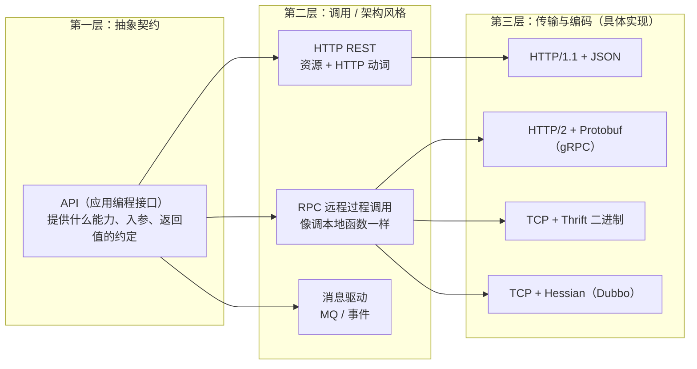
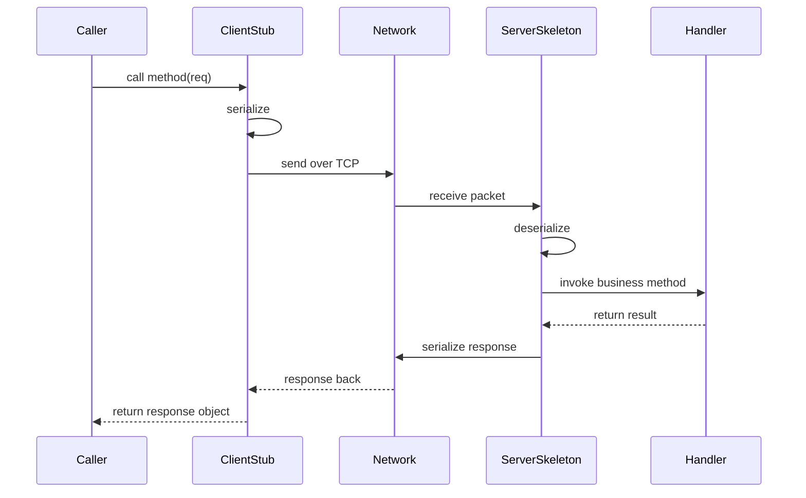

很多从 Java Web 入门的同学会形成“服务间互调 = 调 HTTP API”的直觉，而进入字节这类以 Thrift/gRPC 为主的微服务环境后又会频繁听到 RPC，容易把两者当成对立的两套东西。本文从概念层次讲清 API、HTTP、RPC 三者的关系，再对比两种调用方式的完整链路与差异，最后给出选型与共存的工程判断。

> **一句话结论**：三者不在同一层。**API 是“接口约定”这个抽象概念，RPC 是“像调本地函数一样调远程能力”的调用模式，而 HTTP REST 只是实现 API 的一种具体方式**。RPC 与 HTTP 并不对立：RPC 是一种调用风格或目标，它既可以跑在自定义 TCP 二进制协议上（Thrift、Dubbo），也可以跑在 HTTP/2 上（gRPC）；HTTP REST 则是一种以资源为中心、基于 HTTP 语义的具体接口风格。

## 先理清三个层次：它们不是一回事



| 概念 | 所处层次 | 回答的问题 |
| --- | --- | --- |
| **API** | 抽象契约 | 我对外提供什么能力？你传什么、我返回什么？与用什么技术传输无关 |
| **RPC** | 调用模式 | 如何让“调用另一台机器上的函数”在代码里看起来像本地函数调用，屏蔽网络细节 |
| **HTTP REST** | 具体风格 | 用 URL 表示资源、用 HTTP 动词表示动作、通常用 JSON 承载数据的一种 API 实现 |

所以严谨的说法不是“API 和 RPC 什么关系”，而是：**HTTP REST API 和 Thrift/gRPC 这类 RPC 接口，是“API”这个抽象契约的两种主流落地方式**。

## 什么是 RPC：目标是“远程调用本地化”

### 它想消除的痛点

没有 RPC 框架时，服务 A 想调用服务 B 的能力，需要手写：建立 TCP 连接、约定字节格式、拼包/拆包、处理粘包、序列化反序列化、处理超时重试……每个服务都重复造一遍。RPC 的核心目标就是把这些脏活封装掉，让调用方写出这样的代码：

```java
// 调用方
RecommendResponse resp = recommendService.mGetRecommend(request);
```

至于这行代码背后发生了网络通信，调用方在业务代码层面无需关心。

### 一次 RPC 调用背后发生了什么



### RPC 的标准组成

1. **IDL 接口定义**：用中立语言声明服务与数据结构（Thrift 用 `.thrift`，gRPC/Protobuf 用 `.proto`）。
2. **代码生成（Stub/Skeleton）**：编译器据此生成客户端桩与服务端骨架，支持多语言。
3. **序列化协议**：结构体与二进制之间相互转换（Protobuf、Thrift Binary/Compact、Hessian 等）。
4. **传输层**：通常是 TCP 长连接（gRPC 基于 HTTP/2）。
5. **运行时能力**：连接池、负载均衡、超时、重试、熔断、服务发现等。

## HTTP REST API：一种以资源为中心的具体实现

在 Java Web 里，Spring Boot 的 `@RestController` 暴露 `POST /api/recommend`，对方用 RestTemplate、Feign 或 OkHttp 调用，数据是 JSON。这是一套非常具体的技术组合：

- **应用协议**：HTTP/1.1（或 HTTP/2），文本协议，方法、路径、Header、Body 语义清晰。
- **架构风格**：REST。URL 定位资源（`/orders/123`），HTTP 动词表达操作（GET 查询、POST 创建、PUT 更新、DELETE 删除）。
- **数据格式**：多为 JSON，人可读、自描述、与语言无关。
- **契约**：通常靠文档（OpenAPI/Swagger）约定，框架不在编译期强制两端一致。

它的优点是**通用、开放、可直接用浏览器或 curl 调试、天然穿透各类网关与防火墙、跨语言跨组织无障碍**，因此成为对外 API 和 Web 前后端通信的事实标准。

## 核心区别：逐维度对比

| 维度 | HTTP REST API | RPC（Thrift / gRPC / Dubbo） |
| --- | --- | --- |
| 抽象层次 | 一种具体的 API 风格（基于 HTTP） | 一种调用模式；HTTP/REST 与 RPC 不是同一层概念 |
| 调用感受 | 手动拼 URL、Header、Body，发 HTTP 请求 | `service.method(req)`，与调本地方法一致 |
| 契约约束 | 靠文档约定，容易出现两端不一致，运行期才暴露 | IDL 强制契约，改接口后两端重新编译即报错 |
| 序列化 | JSON 文本，自描述、体积大、解析有开销 | Protobuf/Thrift 二进制，体积小、解析快、强类型 |
| 连接方式 | 传统 HTTP/1.1 多为短连接或普通连接（可复用 Keep-Alive） | TCP 长连接与连接池，省去重复握手 |
| 性能特征 | 文本解析与 HTTP 头开销较大，吞吐和延迟相对较弱 | 二进制紧凑、多路复用（gRPC/HTTP2），更适合高 QPS、低延迟 |
| 可观测与调试 | curl 或浏览器可以直接访问，人可读 | 需要专用客户端或工具，二进制不可直接阅读 |
| 跨组织互通 | 极强，对外开放、第三方集成首选 | 更适合组织内部，外部使用需要统一 IDL 与框架 |
| 典型代表 | Spring MVC、Servlet、各类 Open API | Thrift/fbthrift、gRPC、Dubbo、Thrift 内部封装（如 Archon） |

> 性能差异是**工程取舍**而非绝对鸿沟：HTTP/2 + Protobuf 的 gRPC 本身就是“RPC 风格 + HTTP 传输”；而带连接池与压缩的 HTTP/1.1 也不慢。真正的区别更多在**编程模型（资源 vs 方法）、契约强度（文档 vs IDL 编译期约束）和适用边界（开放 vs 内部高频）**。

## 一个常见误解：“RPC 一定不用 HTTP”

不对。RPC 描述的是**调用风格**，不绑定底层传输：

- **Thrift / 经典 Dubbo**：自定义 TCP 二进制协议，追求极致轻量。
- **gRPC**：对外仍是 `stub.method()` 的 RPC 模型，但底层规定跑在 **HTTP/2** 上，用 Protobuf 编码，支持单连接多路复用、流式调用。
- **很多“HTTP API”**：通过 Feign 之类声明式客户端，调用时写的也是接口方法，编程体验已经很接近 RPC，区别在于其契约和编码仍是 HTTP + JSON。

因此更准确的心智模型是：**“方法式调用 + 强契约 + 高效编码”是 RPC 的内核；至于传输用裸 TCP 还是 HTTP/2，是某一代框架的具体选择。**

## 工程中如何选型

| 场景 | 通常选择 | 原因 |
| --- | --- | --- |
| 对外开放 API、第三方或跨公司集成 | HTTP REST | 通用、易调试、易穿透网关，接入方无需统一技术栈 |
| 浏览器或移动端前后端通信 | HTTP（REST 或 GraphQL 等） | 浏览器原生支持 HTTP/JSON |
| 公司内部服务间高频互调、毫秒级延迟敏感 | RPC（Thrift/gRPC/Dubbo） | 二进制紧凑、长连接、IDL 强契约、内置治理能力 |
| 多语言团队，需要流式或双向流 | gRPC | 跨语言代码生成成熟，HTTP/2 多路复用与 streaming |
| 解耦、削峰填谷、异步处理 | 消息队列（非 RPC，也非同步 HTTP） | 需要的是异步事件而非同步调用结果 |

## 真实系统里两者通常共存

以一个推荐服务（如字节内部的 Thrift C++ 服务）为例：一次请求在内部要 fanout 调用数十个下游（特征、召回、排序、预估），链路高频且对延迟极度敏感，因此**内部服务间用 Thrift RPC**。二进制包更小、TCP 长连接省握手、IDL 强约束，C++、Java、Go 可直接反序列化成结构体。

但当同一能力需要对公司外部业务方开放时，通常会再包一层：

```text
外部调用方
   │  HTTP/JSON（REST，开放、易接入）
   ▼
API Gateway / BFF
   │  协议转换后用 Thrift RPC 内部调用
   ▼
内部 Thrift 微服务集群（Sati / Sort / Predict ...）
```

外部走 REST 保证通用性与可治理性（鉴权、限流、灰度在网关统一做），网关内部转成 RPC 保证高性能。**这不是二选一，而是按边界分层使用**。

## 类比帮助记忆

| 比喻 | HTTP REST API | RPC |
| --- | --- | --- |
| 通信方式 | 寄明信片：地址（URL）写在信封上，内容是人话（JSON），谁都能看懂，但占地方、写起来慢 | 公司内部对讲机：按暗号手册（IDL）说编号和压缩内容，外人听不懂，但内部沟通又快又省事 |
| 编程视角 | “我对哪个 URL 做什么动作” | “我调用哪个对象的哪个方法” |

## 速记小结

- **API 是契约，HTTP REST 和 RPC 是两种落地风格**，三者不同层，不要把 HTTP API 与 RPC 对立。
- RPC 的本质是**远程调用本地化 + IDL 强契约 + 高效编码 + 内置治理**，传输可用 TCP，也可用 HTTP/2（gRPC）。
- HTTP REST 强在**开放、通用、可调试**；RPC 强在**性能、契约约束、内部高频调用体验**。
- 选型看**边界**：对外开放或浏览器使用 HTTP，内部高频低延迟使用 RPC，异步解耦使用 MQ。
- 成熟架构里它们**分层共存**：外部 REST 网关 + 内部 RPC 服务网格。
