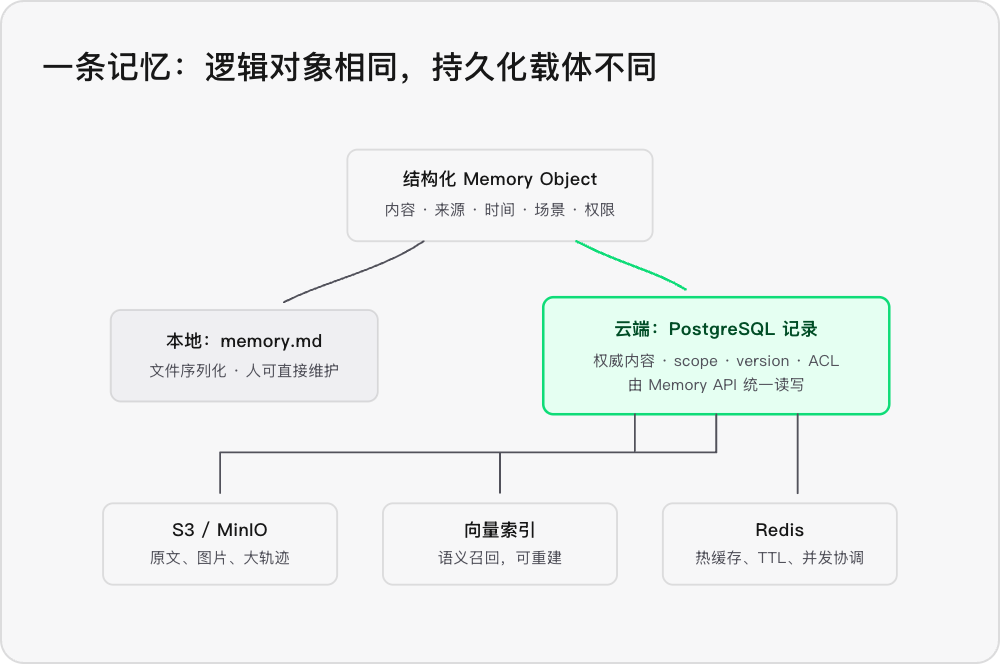

<!-- interviewqa:section question -->
<!-- interviewqa:end -->

<!-- interviewqa:section answer -->
<!-- interviewqa:end -->

<!-- interviewqa:section analysis -->
短期记忆

.josnl 追加式


长期记忆

`memory.md` 只是“记忆对象的一种序列化形式”，不是记忆系统本身。云上 Agent 通常把每条记忆存成数据库记录，并把原文、向量索引和审计记录拆到各自适合的存储里；我用一张简图把这层关系说明白。



`memory.md` 只是本地 Coding Agent 方便人类阅读和 Git 管理的一种 序列化载体 ，不是“记忆”的本质。

云端 Agent 中，一条记忆通常是一条数据库记录：
```code
{

  "id": "mem_123",

  "tenant_id": "org_01",

  "scope": "project/interviewqa",

  "type": "engineering_decision",

  "content": "图片路径需要进行 URL 编码",

  "source_uri": "s3://traces/session-88.json",

  "source_hash": "sha256:...",

  "author_agent_id": "debugger",

  "created_at": "2026-09-23T10:00:00Z",

  "valid_from": "...",

  "valid_to": null,

  "use_cases": ["debugging", "code_generation"],

  "status": "verified",

  "version": 3,

  "acl": ["agent:coder", "agent:reviewer"]

}
```

典型存储方式是：

- PostgreSQL/MySQL ：保存记忆正文、来源、作用域、版本、权限、有效期，是权威数据。
- S3/MinIO ：保存原始对话、日志、图片、代码快照等大对象，数据库只保存引用。
- pgvector/向量库 ：保存 Embedding 和`memory_id` ，只负责召回。
- Redis ：保存热点记忆、会话状态、TTL 和并发锁，不作为最终真相源。

所以可以这样理解：

> 本地的`memory.md` ，相当于云端`memories` 表中若干记录导出后形成的“人类可读视图”。

云端仍然可以生成 Markdown，供审阅、导出或版本管理，但它通常不再是权威存储。真正的核心是 Memory Object + Memory API + 数据库事务 ，而不是文件格式。
<!-- interviewqa:end -->
