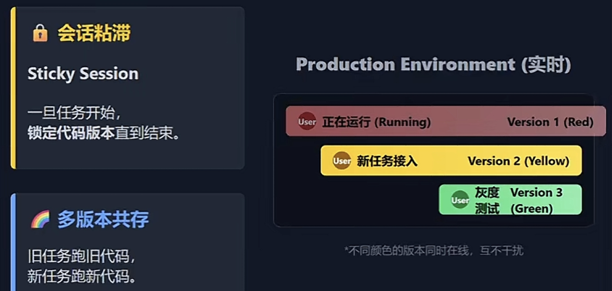
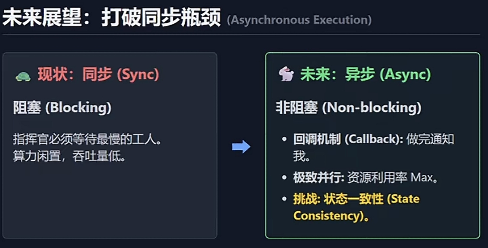

# ✅生产级多Agent避坑指南：断点续传、无感监控与彩虹部署

## 题目

生产级多Agent避坑指南：断点续传、无感监控与彩虹部署

## 标签

[TODO](../../tags/TODO.md)

## 题目导航

← [多智能体记忆管理与防爆策略](多智能体记忆管理与防爆策略) | 无 →

## 面试直接答

> 来源：mubu已总结文档-迁移；[https://v.douyin.com/u4QwB83o4og/](https://v.douyin.com/u4QwB83o4og/)

1）绝不重启，重启成本极高：浪费Token、浪费时间、用户体验极差；把记忆、计划、执行步骤、中间结果全部存盘，故障后从断点继续执行，不从头重来。 

2）无感监控：直接看对话内容侵犯隐私，因此采用只看骨架（决策模式、交互结构、报错状态）、不看血肉（具体对话，用户隐私数据）的高层监控； 

3）彩虹部署（多版本长期共存，温和、长周期、不打断任务）长任务不中断的热更新；

## 详细解析

> 多Agent系统要真正落地到7×24小时生产环境，会面临远高于传统软件的稳定性挑战。Anthropic 在实际工程中总结出一套完整的解决方案，覆盖状态管理、异常自愈、可观测性、部署升级、异步架构五大核心问题。

### 一、核心痛点：Agent 系统天生脆弱

#### 1. 极度敏感：微小改动 -→ 蝴蝶效应（级联故障）

微小改动（标点、格式、提示词）就可能导致Agent行为剧变，不再调用工具、陷入死循环。

#### 2. 高度有状态

研究型任务可长达几十分钟到几小时，依赖长对话历史与中间变量，++错误会逐级累积放大++。

#### 3. 非确定性

同样输入可能跑出不同结果，++本地极难复现线上问题++。

### 二、稳定性两大铁律：断点续传，利用AI自愈

> Claude团队提出了两条铁律来保障可靠性；

#### 1. 绝不重启：断点续传（状态序列化 + 持久化存储）

1）重启成本极高：浪费Token、浪费时间、用户体验极差。

2）把记忆、计划、执行步骤、中间结果全部存盘，故障后从断点继续执行，不从头重来。

- 方案：状态序列化 + 持久化存储
- 把`记忆、计划、执行步骤、中间结果`全部存盘，故障后从断点继续执行，不从头重来。

#### 2. 利用AI自愈：异常不抛出

> 把报错喂给agent，让他自己修；

- 传统程序：API报错直接抛异常退出。
- Anthropic做法（Agent 方案）：工具错误时，不抛出异常，把错误信息丢给Agent自己处理
  ```
  告诉agent工具挂了 → 换参数重试 → 换工具执行 → 自动绕坑
  ```
- 配合传统重试机制，大幅提升稳定性。

### 三、调试新范式：`无感监控`（保护隐私的可观测方案）

> 通过监控决策模式，来定位非确定性bug

直接看对话内容侵犯隐私，因此采用：
```
只看骨架（决策模式、交互结构、报错状态）、不看血肉（具体对话，用户隐私数据）的高层监控：
```

1）不看用户说什么、不看具体内容，只监控`行为结构`：

- 这一步是搜索还是思考？
- ​是否循环调用同一工具？
- ​派了多少子Agent？
- ​任务成功/失败/卡住？

2）只抓结构化行为数据，不碰隐私，就能定位逻辑Bug。

### 四、彩虹部署：长任务不中断的热更新



传统`蓝绿部署`不适合Agent，因为任务可能跑数小时，新版本不能直接覆盖旧版本。

`彩虹部署`核心思想：

- 1）系统内同时运行多版本代码（V1、V2、V3…）
- 2）`会话粘滞`：任务从哪个版本开始，就全程用哪个版本跑完
- 3）新请求进新版，老任务跑完旧版；
- 4）实现无中断升级、频繁发版、长任务安全；

与蓝绿部署区别：

- 1）蓝绿：快速切流量，旧版很快下线；
- 2）彩虹：`多版本长期共存`，温和、长周期、不打断任务；

### 五、未来方向：异步并发架构



#### 当前问题
```
同步阻塞：指挥官派活给多个Agent后，必须等最慢的那个完成才能继续，算力闲置、吞吐量被锁死。
```

#### 未来异步架构

- 1）指挥官派完活立刻去处理其他请求；
- 2）子Agent完成后主动回调汇报结果；

#### 优势

- 1. 极致并行，可递归派生子Agent；
  > 目前不允许递归派生；
- 2. 资源利用率大幅提升；

#### 异步挑战

- 1）状态一致性极难保证；
- 2）竞态条件、跨链路错误传递、前提冲突；
- 3）是下一代多Agent必须攻克的工程难题；

### 六、总结

生产级多Agent系统不是写个Prompt那么简单，而是一套复杂系统工程，需要在：算力成本、响应速度、结果质量、用户隐私、稳定性之间做精细权衡。而多Agent协作，依然是通往更高智能的必经之路。

<!-- created: 2026-08-16 00:40:27 -->
<!-- updated: 2026-08-16 00:52:22 -->
