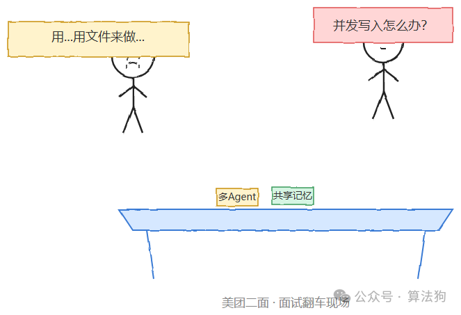
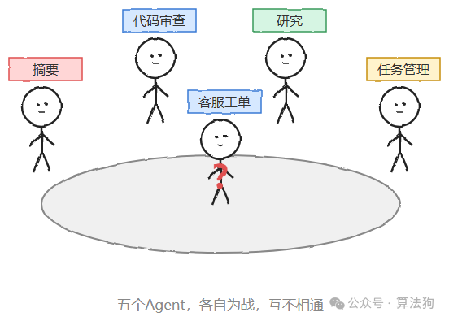
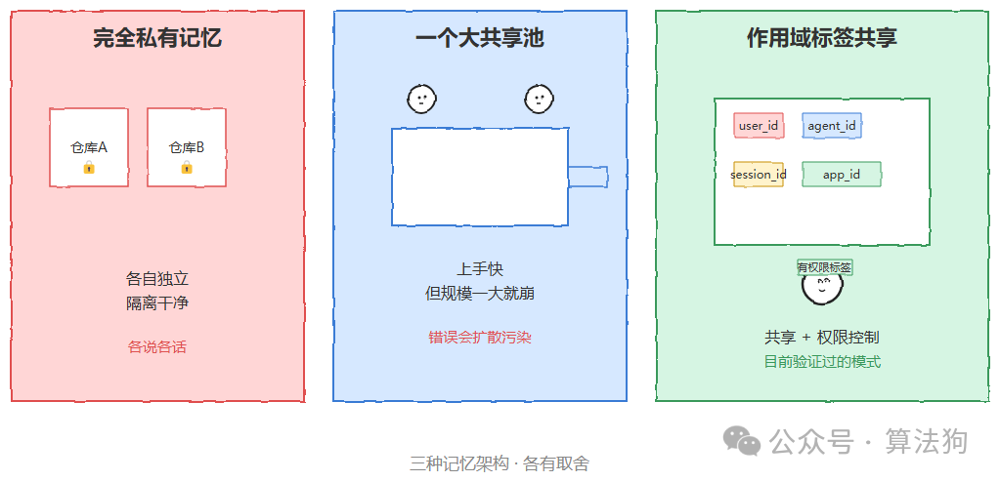
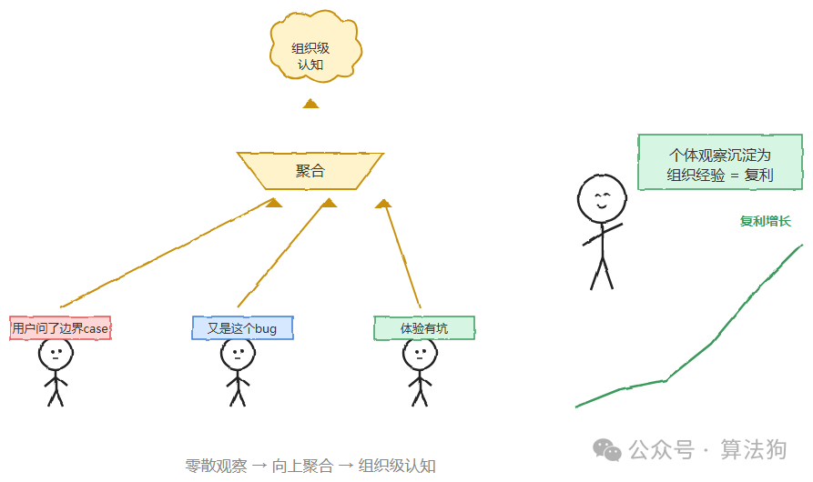
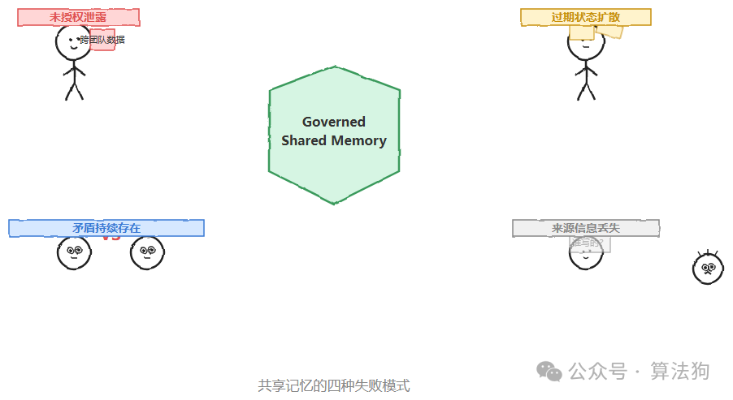
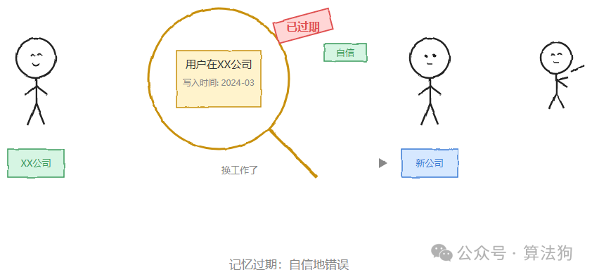
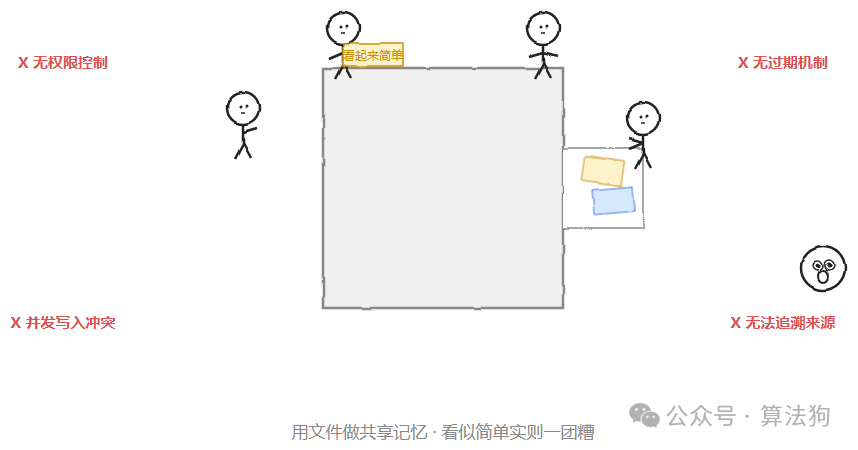

# 大模型二面被问："多Agent之间怎么实现共享记忆？"我立马答"用文件来做"，又句"那并发写入怎么办、权限怎么控制？"，我当场就卡住了。

前几天二面，面试官问我："多Agent之间怎么实现共享记忆？"

我当时脑子一热，随口答了句"用文件来做"——面试官愣了一下，追问了句"那并发写入怎么办、权限怎么控制？"，我当场就卡住了。

回来越想越不对劲，这个问题真的没那么简单。它其实是个正儿八经的系统设计问题，业界这两年也在认真讨论。今天就把这个坑填一下，顺便梳理清楚，如果再被问到，应该怎么答才靠谱。

回到正题：如果你最近在搭多Agent系统，大概率会撞上这个问题。你想啊，五个Agent，一个做摘要、一个做代码审查、一个做研究、一个管任务、一个处理客服工单，每一个单独拿出来都很能打，但彼此之间完全不知道对方在干什么。

这不是巧合，是几乎所有主流框架的默认设计。每个Agent拿到一个上下文窗口，可能配一个向量库，这就是它认知世界的边界。当你从一个Agent扩展到五个、五十个的时候，这套模式不是性能下降，而是直接崩掉。

问题的根子不是算力，不是模型质量，也不是框架成熟度——是记忆。

### **为什么"共享"比"检索"更难**

单Agent记忆研究已经相当成熟了。LoCoMo、LongMemEval这些评测基准把"记得住"这件事量化得很细。但多Agent场景的难点从来不是"存不存得下"。而是谁能写、谁能读、写的东西怎么不冲突、旧的东西怎么知道该扔了。

有研究者干脆把这个问题拆成了一个经典的计算机体系结构问题。他们区分共享内存和分布式内存两种范式，提出I/O、缓存、内存的三层记忆层级。然后指出两个关键的协议缺口——跨Agent的缓存共享，和有结构的内存访问控制。他们认为，眼下最棘手的开放问题是多智能体记忆一致性。

翻译成人话就是：当五十个Agent同时在读写同一块记忆，怎么保证A看到的世界和B看到的世界不是两个版本？

### **三种典型做法**

目前业界收敛出来的方案大致分三类，各有取舍。

完全私有记忆。每个Agent一个独立小仓库，只有自己能读写。好处是隔离干净、权限简单。坏处是团队协作时经常各说各话——这也是研究者用来对比的基线配置之一，每个智能体都有一个仅由该智能体读写的独立存储。

一个大共享池。所有Agent写进同一个地方，谁都能读。上手快，第一个月体验很好。但规模一大立刻出问题——没有权限边界，一个Agent的错误观察会污染所有Agent的判断。

按作用域打标签的共享记忆。这是目前相对成熟、也是Mem0等框架在实践中收敛出来的模式：每一条记忆写入时都打上身份作用域标签，比如user\_id、agent\_id、session\_id、app\_id，检索时再按需组合这些作用域。写入通过统一的API走，API会校验这个Agent到底有没有权限写这个作用域。

这套设计的精妙之处在于它同时解决了两件事。既让50个Agent能共享观察，又不至于谁都能改谁的记忆。更进一步，当很多Agent都观察到同一种模式，比如"企业版用户总在问同一个边界case"，系统还能把这些零散观察向上聚合成组织级的更高阶认知。这才是多Agent系统真正"复利"的地方：个体的观察沉淀成组织的经验，而不是每次都从零开始。

### **绕不开的四个坑**

一套Governed Shared Memory，也就是治理型共享记忆架构的研究把多Agent共享记忆的失败模式归纳得很扎实，一共四种：未授权泄露、过期状态扩散、矛盾持续存在、来源信息丢失。

这几个坑不是理论假设。同一份研究在实测中发现，一个被信任范围限定的Agent能取到本该被拒绝的跨团队数据行。问题出在权限过滤只在部分环节生效，而不是端到端强制执行。这提醒了一件容易被忽视的事：共享记忆首先是个安全问题，其次才是个功能问题。写权限校验、读时的作用域过滤，这两件事必须做到"处处生效"，而不是"大部分时候生效"。

另外还有一个更隐蔽的坑：记忆的过期。一条关于用户所在公司的记忆，在他换工作之前都是对的，换工作之后就变成一条"自信地错误"的记忆。低相关性的记忆可以靠衰减机制处理掉，但高相关性记忆的过期检测，目前仍然是个没解决的难题。

### **落地时的几个实际建议**

如果你现在就要动手，这几条大概率能帮你少走弯路：

别从"一个大池子"开始，哪怕看起来最简单。它在第一个月表现很好，之后就会持续拖后腿。写入时强制带作用域标签，读取时按作用域组合，这是目前唯一在多Agent场景下验证过能规模化的模式。权限校验要做到端到端，尤其是检索环节，不要只在写入时把关。为聚合留出空间：单条记忆之上，考虑设计一层"多个Agent的共识会被沉淀为组织级认知"的机制，这是多Agent系统区别于多个单Agent堆叠的关键。提前设计过期与来源追溯：每条记忆知道自己是谁写的、什么时候写的，出问题时才追得回去。

多Agent系统里，模型能力已经不是瓶颈了。真正决定系统能不能规模化、能不能形成"集体智能"而不是"一堆各自为战的个体"的，是记忆架构设计得好不好。这大概也是为什么2026年会有专门的学术会议把它当成体系结构问题来正式讨论——它值得。

### **回头看，"用文件"到底差在哪**

说回开头那个尴尬瞬间。"用文件做共享记忆"其实不算离谱，本质上就是最原始版本的"一个大共享池"——所有Agent读写同一份存储介质。真正的问题在于我当时没往下延伸：

文件系统没有作用域标签，谁都能读所有内容，权限从设计上就不存在。并发写入极易冲突，没有事务性保证，脏读脏写是必然。没有过期机制，旧信息和新信息混在一起，没人负责清理。出了问题也没法追溯是哪个Agent、什么时候写坏的。

如果当时能把这几点说出来，再补一句"生产环境会考虑按作用域标签设计写入API，加访问控制"，这道题大概率就答上去了。技术面试里，很多时候答案本身对不对没那么关键，关键是你知不知道这个答案的边界在哪。这篇文章，也算是替自己把这堂课补上。

## 标签

## 题目导航

← [生产级多Agent避坑指南：断点续传、无感监控与彩虹部署](005-生产级多Agent避坑指南：断点续传、无感监控与彩虹部署.md) | 无 →

<!-- created: 2026-09-22 14:49:44 -->
<!-- updated: 2026-09-22 14:51:14 -->
